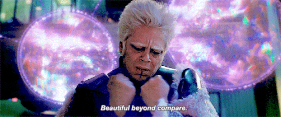

# README

***

이 책은 내가 유닉스와 리눅스 기초를 공부하면서 구글링을 한 뒤 내 구글 앱에서 추천해주는 블로그들을 그때 당시에는 읽지 않고 스크랩만 해뒀다가 지금에서야 읽어보기 위해 만들었다. 

책을 읽는다는 것은 정말 힘든 일이다. 특히나 기술관련 책을 읽는다는 것은 말이다. 작년 봄에 도서관에 가서 학교 시험을 위해서 공부를 하려고 관련된 책을 읽었는데 머리가 깨질듯이 아프고 도대체 무슨 말인지 이해가 안됐다. 

왜 그런 현상이 일어난 것일까?

나는 어릴 때부터 걸어다니면서 책을 읽을 정도로 책을 사랑하고 대부분의 시간을 지역 도서관에서 보냈다.  그런데 사회생활을 하면서 돈을 벌기 위해서만 살기 시작하면서부터는 책을 읽지 않고, 급하게 웹서핑으로 지식을 습득하면서 살아와서인지, 책을 읽는 것이 너무나 큰 고통으로 다가왔다. 그리고 책을 차분히 읽고 습득하려는 의지도 부족하고 그저 빨리 익히려고 욕심을 부렸다. 

그런데 작년 여름 이후부터 논문 때문에 똑같은 글을 100번을 넘게 읽으면서 고치다보니 점점 책을 읽는게 자연스러운 일이 되고, 더 체화하기 위해서 책에 나온 그림까지 내 방식으로 따라 그리고 작가가 하는 말을 온전히 이해하기 위해서 내가 그 작가가 된 것처럼 따라 쓰기까지 했다. 

결국 책을 읽는다는 것은 시간을 가지고, 그 사람이 하는 말을 곱씹어 생각하면서, 똑같이 따라해보는 것이 아닐까? 무엇보다 중요한 것은 시간을 가진다는 것이다. 그 책을 이해하기 위한, 작가의 생각과 의도를 공감하기 위한 시간을 가진다는 것이다. 

20대 때는 TV와 만화프로그램에 사로잡혀있었고, 그 바보 상자는 나에게 자극적인 말과 행동, 유혹, 단순한 생각, 감정에 휩싸인 행동, 폭력적이고 선정적인 장면들로 내 뇌를 가득 채워넣었다. 나는 바보가 되어버렸고, 사회생활을 하면서는 많은 사람들이 나에게 악마가 되라고 강요하는 것만 같았다. 

그래서 어떤 일을 하는지가 중요하고 어떤 사람을 만나는지가 중요하고, 어떤 환경에 놓이는지가 중요한 것 같다. 

프로그래머가 되려면 그 중심에서 활약하는 사람들의 생각과 사고 방식과 습관, 철학, 일상들을 이해하고 닮기 위해 노력해야했는데, 나는 그렇지 못했다. 그래서 너무나 후회가 된다. 그런데 지금부터라도 내가 바뀐다면, 내가 지금 나이가 만 나이로 34인데 지금부터라도 변한다면 앞으로 1년 이내로라도 변화가 생기지 않을까? 

꼭 하버드나 스탠퍼드대학에 가지 않더라도, GNU의 근원지인 MIT 대학을 가지 않더라도 
나 혼자서 온라인 상으로 무언가를 습득하려고 시간을 내고 에너지를 쏟으면 뭔가 바뀌지 않을까 하고 작은 희망이라도 걸어본다. 

 
***
 

This book is a collection of articles recommended by Google applications after reading the Unix and Linux basics.

Reading a book is really hard. Especially reading a technical book. I went to the library last spring and read the related book to study for the school exam, but my head was broken and it did not understand the book at all.

Why did it happen?

Since I was a child, I loved to read books while walking the streets and spent most of my time at the local library. However, since I started living only to earn money while doing my social life, I have not read a book. And I lacked the will to read and acquire books carefully, and I was greedy to learn it quickly.

However, since last summer, I have read the same article more than 100 times, and it is natural for me to read books more and more. I even wrote it down as if I were the artist.

In the end, reading a book means taking time, thinking about what the author is saying, and trying to follow the same thing as the author says. The most important thing is to have time. I have time to sympathize with the artist's thoughts and intentions in order to understand the book.

In the 20s, I was obsessed with TV and comic books, which filled my brain with stimulating words and actions, temptations, simple thoughts, emotional behavior, violent and sensational scenes. I became a fool, and in my social life, it seemed like many people were forcing me to become a demon.

So it is important to know what you are doing, what you are meeting, and what environment you are in.

To become a programmer, I had to try to understand and resemble the thoughts, thoughts, habits, philosophies, and routines of those who are at the center, but I did not. So much regrets. If I change from now on, if I am now 34 years old and change from now on, will not it change within 1 year from now?

Even if I do not go to Harvard or Stanford University, even if I do not go to MIT College, I have little hope that it will change something if I devote time and energy to acquire something online.
