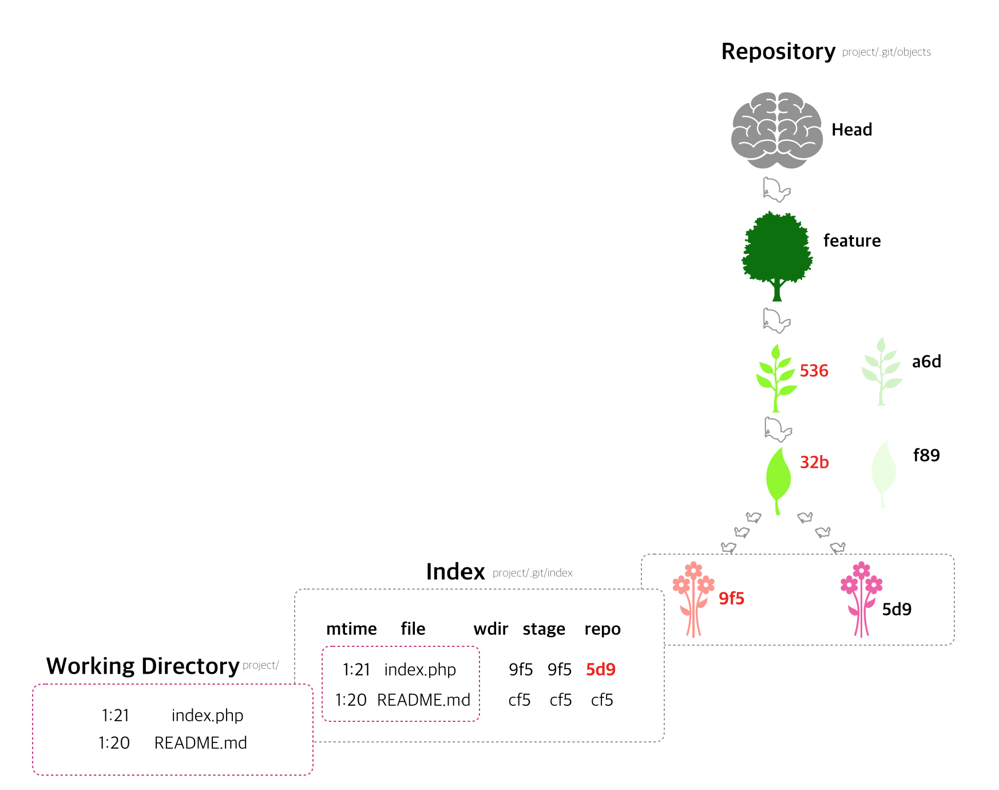

# Understanding Git-Index- Hacker Noon

***

https://hackernoon.com/understanding-git-index-4821a0765cf

***


Zvonimir Spajic

Mar 19

***

* This is the third post in my Understanding Git series so be sure to check out the first two (Data Model and Branching) before proceeding with this one.*


There are there areas where file changes can reside from git's point of view:
working directory, staging area, and the repository.

[그림6-1. Git areas]


When you work on your project making changes you are dealing with your project's working directory. This is the project directory on your computer's filesystem. All the changes you make will remain in the working directory until you add them to the staging ared (via `git add` command). The staging area is best described as a preview of your next commit. Meaning, when you do a `git commit`, git will take the changes that are in the staging area and make the new commit out of those changes. One practical use of the staging area is that it allows you to fine-tune your commits. You can add and remove changes from staging area untill you are satisfied with how your next commit will look like, at which point you can do `git commit`. And after you commit your changes they go into `.git/objects` directory where they are saved as commit, blob and tree objects 

as we saw when we looked at git's [data model](https://hackernoon.com/https-medium-com-zspajich-understanding-git-data-model-95eb16cc99f5)

Although it is often useful to think of staging area as some real area (or directory) where git stores changes (like it does in `.git/objects`) this is not entirely true. Git doesn't have a dedicated staging directory where it puts some objects representing file changes ( [blobs](https://en.wikipedia.org/wiki/Binary_large_object)).

Instead, git has a file called the index that it uses to keep track of the file changes over the three areas: working directory, staging area, and repository. And When you add changes to your staging area, git updates the information in the index about those changes and creates new blob objects, but puts them in the same. 

`.git/objects` directory whith all the other blobs that belong to previous commits. This maybe sounds a bit complicated but actually it isn't, so let's go through a typical git workflow example to display how git uses the index.

<br/><br/>
*** 

Let's say we are on a `master` brench and there is also a `feature` branch in our repository. If we do 

```
git checkout feature
```

three things are going to happen.

First, git will move the `HEAD` pointer to point to the feature ref (branch). To make things more simple we will display only the last commit on the feature branch.

[그림6-2. Git checkout first moves HEAD to feature ref]


Next, git will take the content of the commit that `feature` is pointing to and add it to the index.

 
[그림 6-3. Git checkout updates the index]


As we mentioned earlier **index** is not a directory but a file, so git is not actually storing objects (blobs) into it. Instead, git is storing information about each file in our repository:

 
 * `mtime` -- is the time of last update

 * `file` -- name of the file

 * `wdir` -- file version in working directory

 * `stage` -- file version in the index

 * `repo` -- file version in the repository

<br/><br/>

File version are marked with checksums (if two files have the same checksum then they have the same content/version).

And finally, git will make your working directory match the content of the commit that 	`HEAD` is pointing to (it will recreate the content of your project's directory using tree and blob objects).

<br/><br/>

[그림6-4. Git checkout makes you working directory match HEAD]


So, after checkout, every file will have the same version in the working directory, staging area/index, and the repository.

If we now edit our `index.php` file, 
<br/><br/>

[그림 6-5. Updating index.php only affects the working directory]


those changes will affect only our working directory. But if we now run

```
git status
```


git will first update the index with the now working directory version for `index.php`

<br/><br/>

[그림 6-6. Git status updates the index]


and then it will see that `index.php` has different versions in working and staging directory. 

[그림 6-7. Git status sees that index.php has different version in working directory and staging area]


<br/><br/>

So, git will tell us


```
On branch feature
Changes not staged for commit:
   (use "git add <file>..." to update what will be committed)
   (use "git checkout -- <file> ..." to discard changes in working directory)

modified :   index.php

on changes added to commit (use "git add" and /or "git commit -a")

```

that there are changes in our working directory which are not in our staging area (and therefore won't be included in our next commit at this point).

So let's add our index.php file to the staging area by doing

```
git add index.php
```

Two things are going to happen. First, git will create a blob object for our index.php file and store it into `.git/objects` directory and second. it will again update the index.

[그림6-8. Git add creates blob file for index.php and updates the index]


<br/><br/>

If we now do

```
git status
```

git will see that `index.php` version in staging area matches the working directory version but doesn't match the repository version


[그림 6-9. index.php has different versions in staging area and repository]


so git will tell us:

```
On branch feature
Changes to be committed:
	(use "git reset HEAD <file>..." to unstage)

modified: index.php

```

that `index.php` is now staged to be committed.

And now when we commite our chages


`git commit -m "Adding some code magic to index.php" `

(코드 마술??)


git will:


 * craete a new commit object and tree object (and hook them up with the blob object that was already created with `git add` )

 * move the `feature` ref pointer to the new commit

 * update the index.


<br/>

[그림6-10. Git commit creates commit/tree objects, moves the feature ref, and updates the index]


And now our index.php file agian contains the same versions in all git areas.


***


Ant that is it -- the mystreious git index. Now that we looked at it, it is not so complicated but it is vital to know in order to understand the commands that operate on the index (add, checkout, reset ...).

In writing this post I heavily used Scott Chacon's lecture so be sure to check it out. https://www.youtube.com/watch?v=xbLVvrb2-fY


